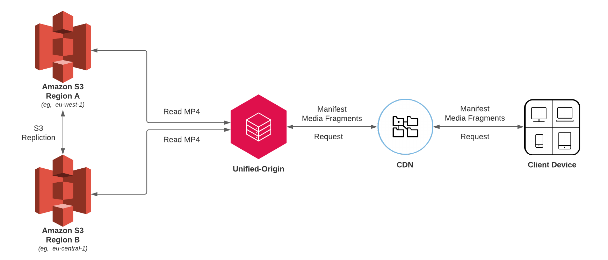

Unified Origin - Storage Proxy (Load-Balanced)
----------------------------------------------


The following demo uses Unified Origin and Apache's [mod_proxy_balancer](https://httpd.apache.org/docs/2.4/mod/mod_proxy_balancer.html) to offer
request load-balancing across multiple HTTP(S) based storage endpoints (S3 buckets).

This project supports both HTTP(S), S3-Auth and Manifest-Edit.

Apache's [mod_proxy_hcheck](https://httpd.apache.org/docs/2.4/mod/mod_proxy_hcheck.html) has been configured to regularly (30s) validate the health of the available endpoint by requesting the file configured as the `HEALTH_CHECK` variable.

Should the health-check failed due to timeout or permissions issues, the relevant endpoint will automatically be disabled allowing for all further requests to be automatically routed to the healthy endpoint.

Requirements
------------
The project must be ran with 2x http based storage locations (which can have different access credentials).

The same content (media/ism) must be accessible using the same paths on each storage. This can be achieved using S3-Replication or manually copying the files between buckets.

### Example Configuration
Below is example of the `remote_storage.conf` file once populated with the necessary variable at runtime.

```apache
<VirtualHost *:81>
 ServerName unified-origin-backend

 LogFormat '%h %l %u %t "%r" %>s %b "%{Referer}i" "%{User-agent}i" %D' log_format

 CustomLog /dev/stdout log_format
 ErrorLog /dev/stderr

 LogLevel debug

<Location "/">
   UspHandleIsm on
   UspEnableSubreq on
   IsmProxyPass http://localhost:81/load-balancer/
 </Location>

 <Location "/load-balancer/">
   ProxyPass "balancer://load-balancer/"
   ProxyPassReverse "balancer://load-balancer/"
 </Location>

 <Proxy "balancer://load-balancer/">
   ProxySet lbmethod=bybusyness failonstatus=403 failontimeout=On forcerecovery=Off nofailover=Off

   # Primary 2 Node Cluster
   BalancerMember "http://localhost:81/usp-s3-eu-west-1.s3.eu-west-1.amazonaws.com/" connectiontimeout=5 timeout=5 ttl=300 keepalive=on retry=60  hcmethod=GET hcuri=/tears-of-steel/tears-of-steel.ism hcinterval=30 hcpasses=1 hcfails=1
   BalancerMember "http://localhost:81/usp-s3-eu-central-1.s3.eu-central-1.amazonaws.com/" connectiontimeout=5 timeout=5 ttl=300 keepalive=on retry=60 hcmethod=GET  hcuri=/tears-of-steel/tears-of-steel.ism hcinterval=30 hcpasses=1 hcfails=1

 </Proxy>

<Location "/usp-s3-eu-west-1.s3.eu-west-1.amazonaws.com/">
  ProxyPass "http://usp-s3-eu-west-1.s3.eu-west-1.amazonaws.com/"
  ProxyPassReverse "http://usp-s3-eu-west-1.s3.eu-west-1.amazonaws.com/"
</Location>

<Proxy "http://usp-s3-eu-west-1.s3.eu-west-1.amazonaws.com/">
    ProxySet connectiontimeout=5 timeout=5 ttl=300 keepalive=on retry=0 timeout=5 ttl=300
</Proxy>

<Location "/usp-s3-eu-central-1.s3.eu-central-1.amazonaws.com/">
  ProxyPass "http://usp-s3-eu-central-1.s3.eu-central-1.amazonaws.com/"
  ProxyPassReverse "http://usp-s3-eu-central-1.s3.eu-central-1.amazonaws.com/"
</Location>

<Proxy "http://usp-s3-eu-central-1.s3.eu-central-1.amazonaws.com/">
    ProxySet connectiontimeout=5 timeout=5 ttl=300 keepalive=on retry=0 timeout=5 ttl=300
</Proxy>
```

The following example uses an encrypted bucket. Therefore access credentials are located in `s3_auth.conf` and have been redacted.  

```text
<Proxy "http://usp-s3-eu-west-1.s3.eu-west-1.amazonaws.com/">
    S3AccessKey *REDACTED*
    S3SecretKey *REDACTED*
    S3Region eu-west-1Â
    S3UseHeaders on
    ProxySet connectiontimeout=5 timeout=5 ttl=300 keepalive=on retry=0 timeout=5 ttl=300
</Proxy>

<Proxy "http://usp-s3-eu-central-1.s3.eu-central-1.amazonaws.com/">
    S3AccessKey *REDACTED*
    S3SecretKey *REDACTED*
    S3Region eu-central-1
    S3UseHeaders on
    ProxySet connectiontimeout=5 timeout=5 ttl=300 keepalive=on retry=0 timeout=5 ttl=300
</Proxy>
```

Usage
-----
This image is usable out of the box, but must be configured using environment variables.

Available variables are:

|Variable        |Usage   |Mandatory?|
|----------------|--------|----------|
|USP_LICENSE_KEY |Your license key. To evaluate the software you can create an account at <https://private.unified-streaming.com/register/>|Yes|
|REMOTE_STORAGE_URL_A|Set a BalanceMember and Proxy Directory to this host in remote_storage.conf|Yes|
|REMOTE_STORAGE_URL_B|Set a BalanceMember and Proxy Directory to this host in remote_storage.conf|Yes|
|HEALTH_CHECK|Set to the location of a file to be used for checking access to the storage |Yes|
|REMOTE_PATH|Set the path to be used for remote storage, defaults to "remote"|No|
|S3_SECRET_KEY_A|If using S3 remote storage sets the secret key for authentication|No|
|S3_ACCESS_KEY_A|If using S3 remote storage sets the access key for authentication|No|
|S3_SECRET_KEY_B|If using S3 remote storage sets the secret key for authentication|No|
|S3_ACCESS_KEY_B|If using S3 remote storage sets the access key for authentication|No|
|LOG_LEVEL|Sets the Apache error log level|No|
|LOG_FORMAT|Sets a custom Apache log format|No|


Example
-------

Build a container from the DockerFile
```Bash
docker build . -t origin:storagelb
```
Then run the container locally on port 1080 with remote storage in S3 and debug logging:

```bash
docker run --rm \
  --name foo \
  -e USP_LICENSE_KEY \
  -e REMOTE_PATH=s3-europe \
  -e REMOTE_STORAGE_URL_A=http://mybucket.s3.eu-west-1.amazonaws.com/ \
  -e S3_ACCESS_KEY_A=<REDACTED> \
  -e S3_SECRET_KEY_A=<REDACTED> \
  -e REMOTE_STORAGE_URL_B=http://mybucket.s3.eu-central-1.amazonaws.com/ \
  -e S3_ACCESS_KEY_B=<REDACTED> \
  -e S3_SECRET_KEY_B=<REDACTED> \
  -e HEALTH_CHECK=/tears-of-steel/tears-of-steel.ism \
  -e LOG_LEVEL=debug \
  -p 1080:80 \
  origin:storagelb
```

Tutorial
--------
A full tutorial is available at <http://docs.unified-streaming.com/installation/evaluation.html>
